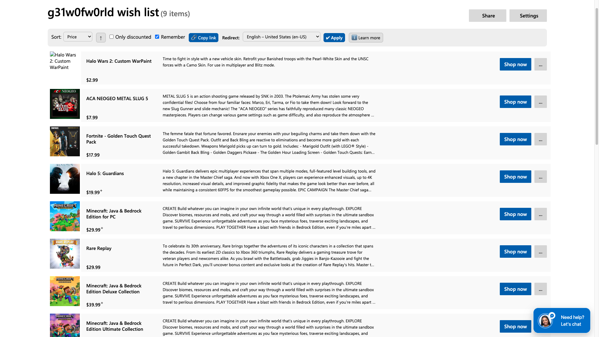
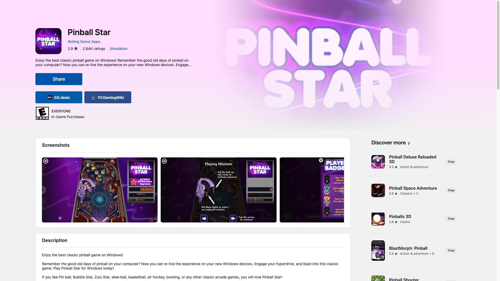

# Microsoft Store Locale Redirect

Tampermonkey userscript that redirects the Microsoft Store to your country/language and adds wishlist tools. / Userscript de Tampermonkey que redirige Microsoft Store a tu país/idioma y añade herramientas a la lista de deseos.

*Wishlist: sort, direction, "only discounted", "remember", copy link, the redirect locale selector with its Apply button, and "Learn more". / Lista de deseos: orden, dirección, "solo con descuento", "recordar", copiar enlace, el selector de locale de redirección con su botón Aplicar, y "Saber más".*

*Game page: the GG.deals and PCGamingWiki buttons, in their own band between the store's action button and the age-rating box, and the same size as it. / Ficha de juego: los botones de GG.deals y PCGamingWiki, en su propia banda entre el botón de acción de la tienda y la caja de clasificación por edades, y del mismo tamaño que él.*

## English

### What it does

**Region redirect**
- Sends Microsoft Store pages — the app pages on `apps.microsoft.com` and your wishlist on `microsoft.com` — to the **language and country you choose**, so you see prices and text for that region instead of the one Microsoft picks for you.
- The selector offers **21 curated locales** (language + country together), so you can only choose combinations the store actually supports. `Auto` means "do not redirect" and leaves the store's own behaviour alone.
- **It redirects two different ways, because the two sites work differently.** On `microsoft.com` the locale is a path segment, so the script rewrites `/en-us/` in the URL; on `apps.microsoft.com` it is a query, so the script sets `hl` and `gl` instead.
- **The preference lives in a cookie on `.microsoft.com`,** not in `localStorage`. The wishlist and the app pages sit on different subdomains and do not share `localStorage`, but they do share the cookie — that is the only way one choice can govern both.
- The redirect uses a **replace, not a new navigation**, so it leaves no extra history entry and the Back button behaves normally instead of bouncing you forward again.
- A stale or malformed saved locale is **detected and cleared** rather than used, which is what stops a bad value from redirecting in a loop.
- **Apply** saves your choice and redirects right away, wishlist included.

**Wishlist**
- **Sort** by date added, name, price or discount percentage, with an **↑ / ↓ toggle** for ascending or descending.
- **Only discounted:** hides everything that is not on sale.
- **Remember:** saves your sort and filters and reapplies them when you come back.
- **Copy link:** builds a URL that reproduces your sort and filters when opened. If the browser blocks clipboard access, it shows the URL in a dialog so you can copy it by hand.
- **"Learn more"** button with the full explanation inside the page, and a tooltip on every control — **drawn by the script itself**, not by the browser: the store has no tooltip of its own to borrow (the only one on the page belongs to Microsoft's universal header), and this toolbar is the script's own UI, so the box uses its palette, opens on keyboard focus too, and is wide enough for the long ones. The browser tooltip stays underneath as the fallback.

**Game pages (`apps.microsoft.com/detail/…`)**
- Adds a **GG.deals** button (prices and deals) and a **PCGamingWiki** button (compatibility and fixes), as their own band **between the store's action button and the age-rating box**, the same way the Xbox twin places them. **They copy that button's size** — measured, not hard-coded, so they still match when the label changes with the language.
- **Games only.** The product kind is asked of Microsoft's public catalog, so apps and subscriptions get nothing: there a price or compatibility lookup would not be a missed search, it would be beside the point. DLC, editions and packs do get them, like the rest of the family.
- **The name comes from that same catalog, in English**, and is kept in localStorage so the call is not repeated. It is needed because both destinations are indexed in English while the page you are looking at is translated. If the catalog does not answer, no buttons are added.
- **The platform tag is stripped from the name** — this store returns titles like "Roblox - Windows", which neither destination uses. **GG.deals opens already filtered to the Microsoft Store DRM** and with no store-rating floor; it gets the full title, PCGamingWiki gets it without the edition suffix, since it documents the base game.
- Both are title searches, so **each says so in its tooltip** — the label carries the destination, the tooltip carries the uncertainty.
- **The script loads across the whole store**, not just on game pages. The store is a single-page app and userscripts are injected on document load, so arriving at a game from a search or a collection — with no reload in between — used to leave the script out entirely and nothing appeared. Loading everywhere also means the region redirect holds across the catalogue and searches, not only on the pages that draw something.
- **The colours are the store's.** Blue for action, like "Buy now" and "Share": the green of the Xbox twin does not exist anywhere in this store's interface, and the buttons and boxes are light, not dark, so they read as part of the page rather than something pasted on top.

**Language:** **13 languages** — English, Spanish, German, French, Italian, Dutch, Portuguese, Polish, Russian, Turkish, Japanese, Korean and Chinese. What wins is the locale you pick in the selector, so the toolbar speaks the same language as the page it sends you to instead of contradicting it; with `Auto`, or before you have picked anything, it falls back to `<html lang>`, then to the locale segment of the path, then to your browser, then to English. The two are still different settings, though: one is how the script talks, the other is the store's region.

**Install:**
1. Install [Tampermonkey](https://www.tampermonkey.net/).
2. Open the installer: [microsoft-store-locale-redirect.user.js](https://github.com/g31w0fw0rld/microsoft-store-locale-redirect/raw/main/microsoft-store-locale-redirect.user.js) (also on [GreasyFork](https://greasyfork.org/es-419/users/1590477-g31w) and [OpenUserJS](https://openuserjs.org/users/g31w0fw0rldgmail.com/scripts)).

**Sites:** `apps.microsoft.com/*`, `microsoft.com/…/store/wishlist`

## Español

### Qué hace

**Redirección de región**
- Lleva las páginas de Microsoft Store —las fichas de app en `apps.microsoft.com` y tu lista de deseos en `microsoft.com`— al **idioma y país que elijas**, para ver precios y textos de esa región en vez de la que Microsoft decide por ti.
- El selector ofrece **21 locales curados** (idioma y país juntos), así que solo puedes elegir combinaciones que la tienda realmente soporta. `Auto` significa "no redirigir" y deja el comportamiento propio de la tienda.
- **Redirige de dos formas distintas, porque los dos sitios funcionan distinto.** En `microsoft.com` el locale es un segmento de la ruta, así que el script reescribe el `/es-mx/` de la URL; en `apps.microsoft.com` es una query, así que en su lugar fija `hl` y `gl`.
- **La preferencia vive en una cookie de `.microsoft.com`,** no en `localStorage`. La lista de deseos y las fichas de app están en subdominios distintos y no comparten `localStorage`, pero sí comparten la cookie — es la única forma de que una sola elección gobierne las dos.
- La redirección usa un **reemplazo, no una navegación nueva**, así que no deja una entrada extra en el historial y el botón Atrás se comporta con normalidad en vez de devolverte hacia delante.
- Un locale guardado obsoleto o mal formado se **detecta y se borra** en vez de usarse, que es lo que evita que un valor malo redirija en bucle.
- **Aplicar** guarda tu elección y redirige al momento, lista de deseos incluida.

**Lista de deseos**
- **Ordenar** por fecha de agregado, nombre, precio o porcentaje de descuento, con un **botón ↑ / ↓** para ascendente o descendente.
- **Solo con descuento:** oculta todo lo que no está en oferta.
- **Recordar:** guarda tu orden y tus filtros y los reaplica al volver.
- **Copiar enlace:** genera una URL que al abrirla reproduce tu orden y tus filtros. Si el navegador bloquea el portapapeles, muestra la URL en un diálogo para copiarla a mano.
- Botón **"Saber más"** con la explicación completa dentro de la página, y un tooltip en cada control —**dibujado por el propio script**, no por el navegador: la tienda no tiene tooltip propio que tomar prestado (el único de la página es el del header universal de Microsoft) y esta barra es UI del script, así que la caja usa su paleta, sale también al enfocar con el teclado y es lo bastante ancha para los avisos largos—. El del navegador se queda debajo como respaldo.

**Fichas de juego (`apps.microsoft.com/detail/…`)**
- Añade un botón a **GG.deals** (precios y ofertas) y otro a **PCGamingWiki** (compatibilidad y arreglos), en una banda propia **entre el botón de acción de la tienda y la caja de clasificación por edades**, igual que los coloca el gemelo de Xbox. **Copian el tamaño de ese botón** —medido, no escrito a mano—, así que siguen coincidiendo cuando la etiqueta cambia con el idioma.
- **Solo en juegos.** El tipo de producto se le pregunta al catálogo público de Microsoft, así que las apps y las suscripciones no reciben nada: ahí una búsqueda de precios o de compatibilidad no es que falle, es que no viene a cuento. Los DLC, ediciones y paquetes sí los llevan, como en el resto de la familia.
- **El nombre sale de ese mismo catálogo, en inglés**, y se guarda en localStorage para no repetir la consulta. Hace falta porque las dos webs de destino están indexadas en inglés y la ficha que ves va traducida. Si el catálogo no responde, no se ponen botones.
- **Al nombre se le quita la coletilla de plataforma** —esta tienda devuelve títulos como "Roblox - Windows", que ninguno de los dos destinos usa—. **GG.deals se abre ya filtrado por el DRM de Microsoft Store** y sin el mínimo de valoración de tienda; recibe el título completo, y PCGamingWiki lo recibe sin el sufijo de edición, porque documenta el juego base.
- Los dos buscan por título, así que **cada uno lo dice en su tooltip** —la etiqueta carga el destino y el tooltip la incertidumbre—.
- **El script se carga en toda la tienda**, no solo en las fichas de juego. La tienda es una SPA y los userscripts se inyectan al cargar el documento, así que llegar a un juego desde una búsqueda o una colección —sin recarga por medio— dejaba al script fuera y no aparecía nada. Cargar en todas partes hace además que la redirección de región valga también en el catálogo y en las búsquedas, no solo donde el script pinta algo.
- **Los colores son los de la tienda.** Azul de acción, como "Comprar ahora" y "Compartir": el verde del gemelo de Xbox no aparece en ninguna parte de esta tienda, y los botones y las cajas van en claro y no en oscuro, para que se lean como parte de la página y no como algo pegado encima.

**Idioma:** **13 idiomas** —inglés, español, alemán, francés, italiano, neerlandés, portugués, polaco, ruso, turco, japonés, coreano y chino—. Lo que manda es el locale que elijas en el selector, para que la barra hable el mismo idioma que la página a la que te lleva en vez de contradecirla; con `Auto`, o antes de que elijas nada, cae al `<html lang>`, luego al segmento de locale de la ruta, luego al navegador, luego a inglés. Aun así son dos ajustes distintos: uno es cómo habla el script, el otro es la región de la tienda.

**Instalación:**
1. Instala [Tampermonkey](https://www.tampermonkey.net/).
2. Abre el instalador: [microsoft-store-locale-redirect.user.js](https://github.com/g31w0fw0rld/microsoft-store-locale-redirect/raw/main/microsoft-store-locale-redirect.user.js) (también en [GreasyFork](https://greasyfork.org/es-419/users/1590477-g31w) y [OpenUserJS](https://openuserjs.org/users/g31w0fw0rldgmail.com/scripts)).

**Sitios:** `apps.microsoft.com/*`, `microsoft.com/…/store/wishlist`

## Privacy / Privacidad

**EN:** the script declares `@grant none`, so it has no access to the userscript manager's privileged APIs. It makes exactly one kind of external request: on a game page it asks **Microsoft's own public catalog** (`displaycatalog.mp.microsoft.com`) for the English name of the product you are already looking at. That request carries only the product code from the URL, goes out with `credentials: 'omit'` so no cookie or session travels with it, and its answer is cached in `localStorage` so the same game is not asked twice. Your country/language preference is stored in its own cookie (`mswl-locale`, domain `.microsoft.com`, one year) because the wishlist and the app pages live on different subdomains that do not share `localStorage`: the cookie holds only the locale you pick, though —like any cookie on that domain— it travels with the requests your browser already makes to `microsoft.com`. The wishlist sort order and filters are stored in `localStorage`, and the redirect only changes the URL within the Microsoft Store itself. Nothing is sent to third parties or to the author.

**ES:** el script declara `@grant none`, así que no tiene acceso a las APIs privilegiadas del gestor de userscripts. Hace exactamente un tipo de petición externa: en una ficha de juego pregunta al **catálogo público de Microsoft** (`displaycatalog.mp.microsoft.com`) el nombre en inglés del producto que ya estás viendo. Esa petición lleva solo el código de producto de la URL, sale con `credentials: 'omit'` así que no viaja ninguna cookie ni sesión, y su respuesta se guarda en `localStorage` para no preguntar dos veces por el mismo juego. Tu preferencia de país/idioma se guarda en una cookie propia (`mswl-locale`, dominio `.microsoft.com`, un año) porque la lista de deseos y las páginas de app viven en subdominios distintos que no comparten `localStorage`: la cookie contiene solo el locale que elijas, aunque —como cualquier cookie de ese dominio— viaja en las peticiones que tu navegador ya hace a `microsoft.com`. El orden y los filtros de la lista de deseos se guardan en `localStorage`, y la redirección solo cambia la URL dentro de la propia Microsoft Store. No se envía nada a terceros ni al autor.

## Support / Apoyar

This is part of something I'm building to grow. If it helps you and you'd like to support it, you can tip me on **[Ko-fi](https://ko-fi.com/g31w0fw0rld)** —only if you want—; and if a cause needs it more than I do, help that one instead.

Esto es parte de algo que estoy construyendo para crecer. Si te sirve y quieres apoyar, puedes invitarme un café en **[Ko-fi](https://ko-fi.com/g31w0fw0rld)** —solo si quieres—; y si hay una causa que lo necesite más que yo, ayúdala a ella.

---
Author / Autor: **g31w0fw0rld** · License / Licencia: **MIT**
